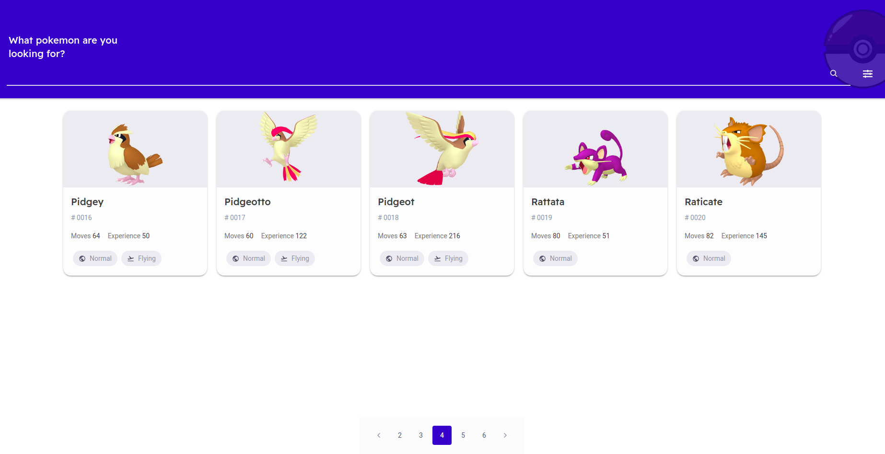
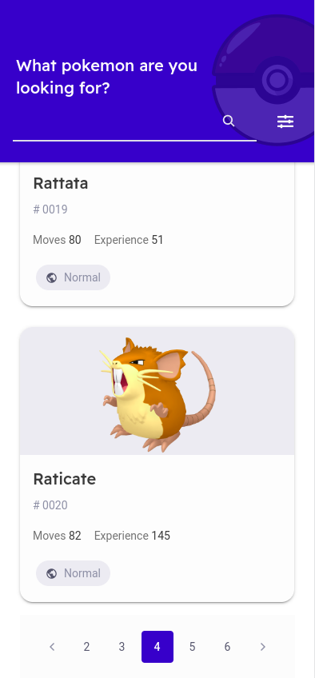

# POKEMON CHALLENGE


Pokemon challenge es un proyecto hecho en Ionic 6 y Vue 3.
Entre sus funcionalidades principales se encuentran:

- Listar pokemons
- Paginar pokemons
- Mostrar caracteristicas detalladas de los pokemons
- Buscar pokemons por su nombre
- Filtrarlos por ciertas características

## ACERCA DEL CÓDIGO

- Se utilizó el patrón repository para inyectar servicios para las llamadas a las apis
- Se utilizó el patrón fachada(en escencia) para simplificar el uso de bibliotechas como chartjs
- Se manejaron las excepciones asiendo uso de eithers
- Se utilizó gitflow, con semantic commits
- Se utilizó semantig version taggeando y haciendo release de las diversas features del desarrollo
- Se desarrolló usando TDD

## INSTALACIÓN
Clonar el proyecto con http

```
https://github.com/Isaac-cura/pokemon-challenge.git
```

O con ssh

```
git@github.com:Isaac-cura/pokemon-challenge.git
```

luego instalamos las dependencias
```
npm install
```
para correr el servidor localmente
```
npm run serve

```
CONGRATULATIONS! 🎉

ya podrás ver algo así en web



y algo como esto en mobile



## TEST

El proyecto se desarrolló usando TDD(en principio) por lo cual cuenta con una suite de test nutrida


para correrlos debes usar el siguiente comando

```
npm run test:unit

```
## Gracias 